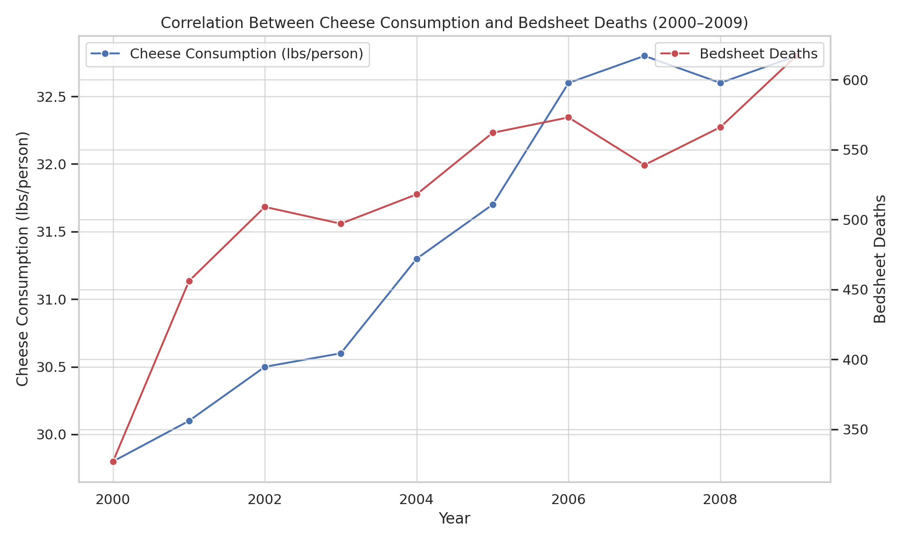

### Cheese Kills: The Curious Case of Cheese Consumption and Death by Bedsheet

This project humorously explores a coincidental yet surprisingly strong correlation between **annual cheese consumption** and **deaths attributed to bedsheet entanglement** over a decade (2000-2009).

The core of this project is a dual-axis line graph that visually demonstrates how these seemingly unrelated metrics rise and fall in near-identical patterns.

---

#### The "Why" (A Fun Hypothesis)

Our entirely unscientific, yet entertaining, hypothesis for this correlation is simple: **Cheese makes you sleepy, and sleep can be dangerous!**

1.  **Increased cheese consumption** leads to higher tryptophan intake, an amino acid known to promote drowsiness.
2.  **Deeper sleep states** mean individuals are less aware of their surroundings and less responsive to discomfort.
3.  **Result:** A "tragic uptick" in fatal sheet entrapments among deep-sleeping cheese enthusiasts.

In essence: *The more cheese you eat, the more likely your sheets will "kill" you.*

*(Disclaimer: This project is for entertainment and illustrative purposes only and should not be taken as serious scientific research.)*

### The Unsettling Visual Evidence

Here's the plot that started it all, showcasing the uncanny correlation:

---

### Project Contents

* `cheese_kills.ipynb`: The Google Colab notebook containing the data visualization and analysis.

---

### Technologies Used

* Python
* Matplotlib
* Seaborn
* Pandas
* Pearsonr

---

### How to Run

1.  Clone this repository.
2.  Open `cheese_kills.ipynb` in Google Colab or a Jupyter Notebook environment.
3.  Run all cells to see the graph and the "analysis."

---

### Author

Feel free to connect and share your own overthought creations:

* **GitHub:** [@zehando](https://github.com/zehando)
* **LinkedIn:** [Sahand Azizi](https://www.linkedin.com/in/sahandazizi/)
* **Email:** azizisahand@gmail.com
